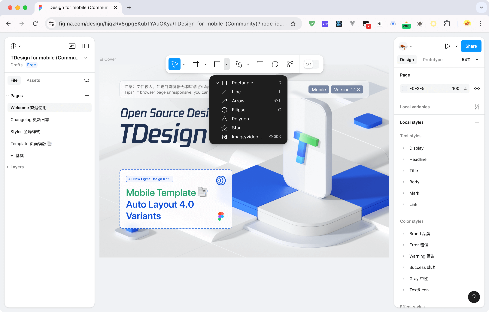

# Adjust Figma Toolbelt

English | [中文](./README.zh-CN.md)

*adjust-figma-toolbelt* is a versatile script designed to enhance your Figma experience by allowing you to reposition the toolbelt with ease.

## Features



## Installation

- [Greasy Fork](https://greasyfork.org/scripts/504114-adjust-figma-toolbelt)
- [Release](https://github.com/palmcivet/adjust-figma-toolbelt/release)
- [Source](https://palmcivet.github.io/adjust-figma-toolbelt/main.js)

For users who have never used Tampermonkey or are not sure how to operate it, you can refer to the [Tampermonkey official documentation](https://www.tampermonkey.net/faq.php) for installation instructions.

1. Open the Chrome Web Store and install the [Tampermonkey](https://chromewebstore.google.com/detail/dhdgffkkebhmkfjojejmpbldmpobfkfo) extension.
2. Open Greasy Fork and [install the script](https://greasyfork.org/zh-CN/scripts/504114-adjust-figma-toolbelt).
3. Find the Tampermonkey extension in the browser toolbar and start using it.

## Development

```bash
git clone https://github.com/palmcivet/adjust-figma-toolbelt.git
cd adjust-figma-toolbelt
pnpm install
pnpm watch
```

## License

See [MIT](./LICENSE).
