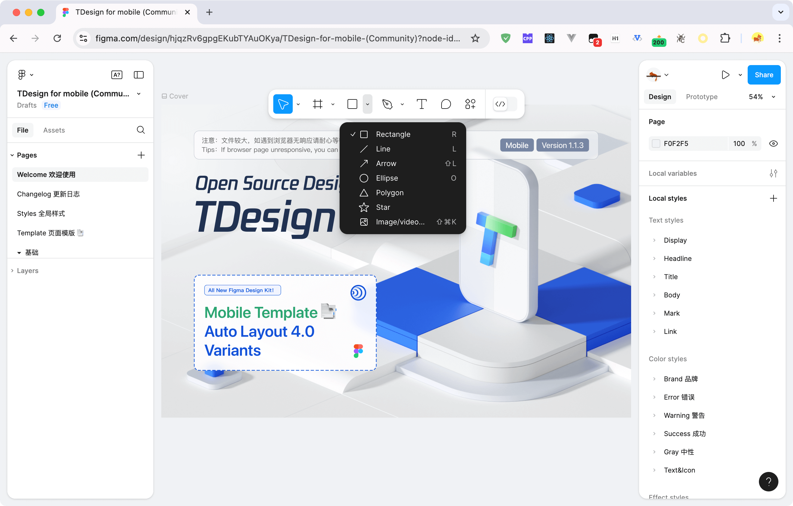

# Adjust Figma Toolbelt

[English](./README.md) | 中文

*adjust-figma-toolbelt* 是一个用于增强 Figma 体验的脚本，可以轻松地将工具栏调整到想要的位置。

## 特性



> 只能在浏览器使用，不支持 Figma Desktop，因为无法注入 JS。

## 安装

有以下方式安装该脚本：

- [Greasy Fork](https://greasyfork.org/scripts/504114-adjust-figma-toolbelt)
- [Release](https://github.com/palmcivet/adjust-figma-toolbelt/release)
- [Source](https://palmcivet.github.io/adjust-figma-toolbelt/main.js)

对于不熟悉 Tampermonkey 的用户，可以参考 [Tampermonkey 官方文档](https://www.tampermonkey.net/faq.php) 进行安装。

1. 打开 Chrome 应用商店，安装插件 [Tempermonky](https://chromewebstore.google.com/detail/dhdgffkkebhmkfjojejmpbldmpobfkfo)；
2. 打开 Greasy Fork，[安装脚本](https://greasyfork.org/zh-CN/scripts/504114-adjust-figma-toolbelt)；
3. 在浏览器工具栏找到 Tempermonky 插件，开始使用。

## 开发

```bash
git clone https://github.com/palmcivet/adjust-figma-toolbelt.git
cd adjust-figma-toolbelt
pnpm install
pnpm watch
```

## 许可证

[MIT](./LICENSE)
